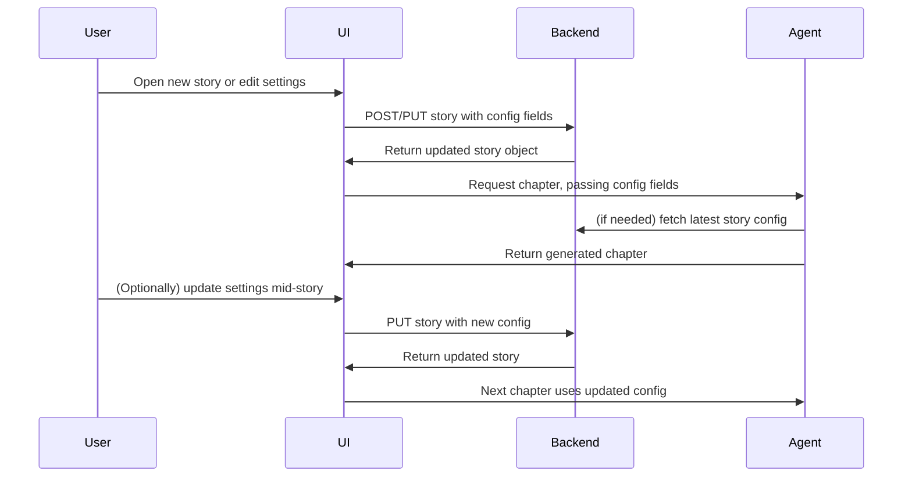

# Premium, Book-like, Responsive UI/UX Redesign Plan

## 1. Overall Design Principles
- **Minimal, distraction-free, book-like reading experience**
- **Premium feel:** soft backgrounds, subtle shadows, rounded corners, elegant typography
- **Responsive:** seamless on both mobile and desktop
- **Consistent layout:** clear separation between login, dashboard, and story reading

---

## 2. Component/Layout Structure

```mermaid
flowchart TD
    A[Login (Auth)] -->|On Success| B[Dashboard]
    B --> C[Story List]
    C -->|Select Story| D[Story View]
    B -->|Logout| A
    D -->|Back| C
```

### Layout Sketch
- **Login:** Centered card, elevated, with clear sign-in/up toggle
- **Dashboard:** 
  - Full viewport background
  - Centered container with:
    - Top bar: Centered title, logout button in top-right
    - Story list: Card/list in center, visually separated items
    - New story button/form: Modal or inline, visually distinct
- **Story View:**
  - Centered, wide but readable container (max-width ~700px)
  - Book-like paragraphs, premium font, generous line height and spacing
  - Minimal UI: only a subtle back button and add-chapter form at the bottom

---

## 3. Styling Approach
- **New CSS classes** (e.g., `.premium-card`, `.dashboard-container`, `.story-list`, `.story-item`, `.story-content`, `.logout-btn`, `.top-bar`)
- **Typography:** Use a premium serif font for story content (e.g., "Merriweather", "Georgia", or Google Fonts alternative)
- **Spacing:** Generous padding/margin, max-widths for readability
- **Colors:** Soft, neutral backgrounds; dark text; subtle accent colors for buttons/links
- **Shadows & Borders:** Soft box-shadows, rounded corners for cards and buttons
- **Responsiveness:** Media queries for mobile (single column, touch-friendly), desktop (centered, wider containers)

---

## 4. Component Refactor Plan

### Auth (Login)
- Replace inline styles with `.premium-card` and `.auth-form`
- Center card with flexbox/grid, add shadow, rounded corners
- Large, clear inputs and buttons
- Responsive: full width on mobile, fixed width on desktop

### Dashboard
- Add `.dashboard-container` for full-viewport background and centering
- Add `.top-bar` with centered title and logout button in top-right (absolute or flex)
- Story list as `.story-list` with `.story-item` cards
- New story form as modal or inline card
- Responsive: stack elements on mobile, center on desktop

### Story View
- `.story-content` for book-like container: max-width, padding, premium font, justified or left-aligned text, large line height
- Chapters separated with spacing, subtle dividers
- Back button as subtle icon/button
- Add-chapter form at bottom, visually unobtrusive

---

## 5. Accessibility & Experience
- All buttons and inputs accessible and touch-friendly
- Focus states and transitions for interactive elements
- No unnecessary distractions (no excessive colors, animations, or icons)

---

## 6. Implementation Steps
1. Create new CSS classes in `App.css` or a new CSS module.
2. Refactor `Auth.tsx` to use new classes and remove inline styles.
3. Refactor `Dashboard.tsx` for new layout, top bar, story list, and story view.
4. Add premium font (e.g., via Google Fonts in `index.html`).
5. Test and tweak responsiveness and spacing.

---

## 7. Pre-Story Configuration & Story Parameter Architecture

### Overview

To enable fine-tuned, dynamic story generation, the platform will introduce a pre-story configuration interface and supporting backend changes. This allows users to set and update story-level parameters such as reading level, story/chapter length, and structural prompts, both before and during a story session.

### 7.1 Data Model Changes

**Stories Table (supabase/schema.sql):**
- Add the following fields:
  - `reading_level` (integer or enum): e.g., 1–10, representing grade level or mapped to age bands.
  - `story_length` (integer): Target total story length (e.g., number of chapters or estimated word count).
  - `chapter_length` (integer): Target length per chapter (e.g., number of words or paragraphs).
  - `structural_prompt` (text, nullable): Optional structure or outline for the story.

**Migration Notes:**
- Existing stories should default new fields to null or reasonable defaults.
- Update all story creation and update logic to handle these fields.

### 7.2 Backend API Changes

**Endpoints:**
- Update story creation endpoint to accept new fields.
- Update story update endpoint to allow modifying these fields mid-story.
- Ensure endpoints validate and sanitize input (e.g., reading level range, positive lengths).

**Story Fetching:**
- Ensure all endpoints that return story data include the new fields.

**Chapter Generation:**
- When generating a chapter, always fetch the latest story parameters and pass them to the agent.

### 7.3 Frontend UI/UX Changes

**Pre-Story Configuration Interface:**
- Add a modal or dedicated screen before story start with:
  - Title input (existing)
  - Initial prompt input (existing)
  - Reading level slider (e.g., "Kindergarten" to "10th Grade")
  - Story length control (slider or number input)
  - Chapter length control (slider or number input)
  - Structural prompt textarea (optional)

**Mid-Story Configuration:**
- Add a "Story Settings" button in the story view to re-open the configuration interface and update parameters.

**State Management:**
- Ensure story settings are stored in local state and synced with backend on submit/update.

**Validation:**
- UI should enforce valid ranges and provide user feedback.

### 7.4 Agent Logic Changes

- Update agent invocation logic to always read the latest story parameters before generating a chapter.
- Pass all relevant parameters (reading level, story length, chapter length, structural prompt) to the agent prompt.
- If parameters are updated mid-story, the next chapter generation should use the new values.

### 7.5 Integration & Update Flow



### 7.6 Summary of Required Changes

- **Database:** Add new fields to `stories` table, migrate existing data.
- **Backend:** Update endpoints for story creation, update, and fetching; ensure chapter generation uses latest config.
- **Frontend:** Implement pre-story and mid-story configuration UI; update state management and API calls.
- **Agent:** Update logic to use all config parameters for chapter generation.

---