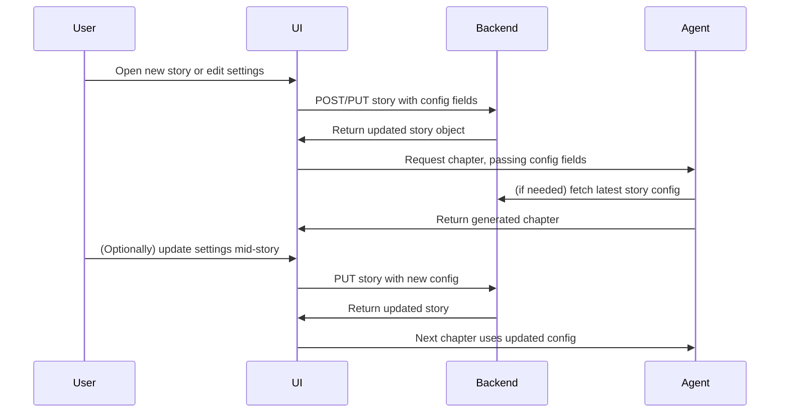
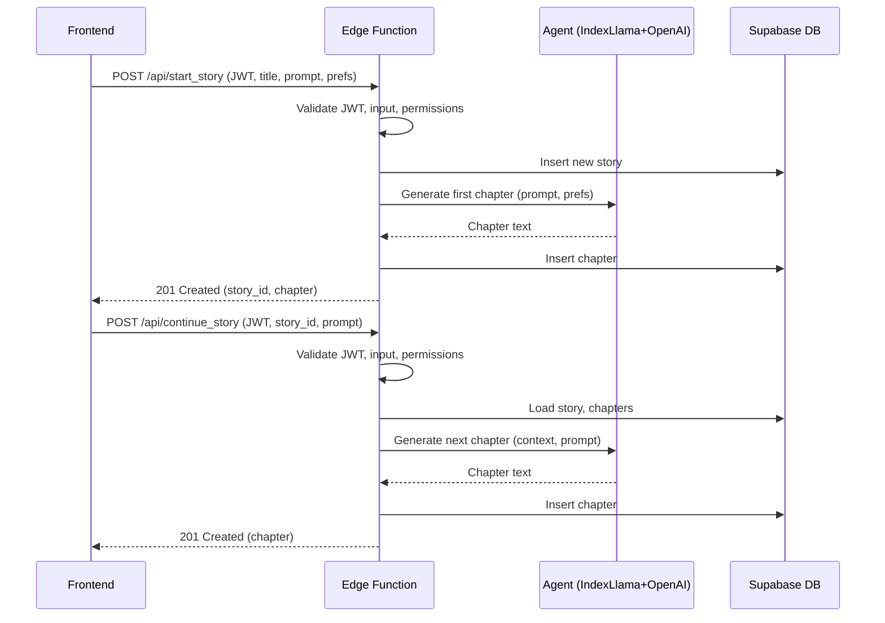
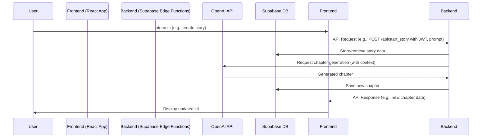

# Premium, Book-like, Responsive UI/UX Redesign Plan

## 1. Overall Design Principles
- **Minimal, distraction-free, book-like reading experience**
- **Premium feel:** soft backgrounds, subtle shadows, rounded corners, elegant typography
- **Responsive:** seamless on both mobile and desktop
- **Consistent layout:** clear separation between login, dashboard, and story reading

---

## 2. Component/Layout Structure

```mermaid
flowchart TD
    A[Login (Auth)] -->|On Success| B[Dashboard]
    B --> C[Story List]
    C -->|Select Story| D[Story View]
    B -->|Logout| A
    D -->|Back| C
```

### Layout Sketch
- **Login:** Centered card, elevated, with clear sign-in/up toggle
- **Dashboard:** 
  - Full viewport background
  - Centered container with:
    - Top bar: Centered title, logout button in top-right
    - Story list: Card/list in center, visually separated items
    - New story button/form: Modal or inline, visually distinct
- **Story View:**
  - Centered, wide but readable container (max-width ~700px)
  - Book-like paragraphs, premium font, generous line height and spacing
  - Minimal UI: only a subtle back button and add-chapter form at the bottom

---

## 3. Styling Approach
- **New CSS classes** (e.g., `.premium-card`, `.dashboard-container`, `.story-list`, `.story-item`, `.story-content`, `.logout-btn`, `.top-bar`)
- **Typography:** Use a premium serif font for story content (e.g., "Merriweather", "Georgia", or Google Fonts alternative)
- **Spacing:** Generous padding/margin, max-widths for readability
- **Colors:** Soft, neutral backgrounds; dark text; subtle accent colors for buttons/links
- **Shadows & Borders:** Soft box-shadows, rounded corners for cards and buttons
- **Responsiveness:** Media queries for mobile (single column, touch-friendly), desktop (centered, wider containers)

---

## 4. Component Refactor Plan

### Auth (Login)
- Replace inline styles with `.premium-card` and `.auth-form`
- Center card with flexbox/grid, add shadow, rounded corners
- Large, clear inputs and buttons
- Responsive: full width on mobile, fixed width on desktop

### Dashboard
- Add `.dashboard-container` for full-viewport background and centering
- Add `.top-bar` with centered title and logout button in top-right (absolute or flex)
- Story list as `.story-list` with `.story-item` cards
- New story form as modal or inline card
- Responsive: stack elements on mobile, center on desktop

### Story View
- `.story-content` for book-like container: max-width, padding, premium font, justified or left-aligned text, large line height
- Chapters separated with spacing, subtle dividers
- Back button as subtle icon/button
- Add-chapter form at bottom, visually unobtrusive

---

## 5. Accessibility & Experience
- All buttons and inputs accessible and touch-friendly
- Focus states and transitions for interactive elements
- No unnecessary distractions (no excessive colors, animations, or icons)

---

## 6. Implementation Steps
1. Create new CSS classes in `App.css` or a new CSS module.
2. Refactor `Auth.tsx` to use new classes and remove inline styles.
3. Refactor `Dashboard.tsx` for new layout, top bar, story list, and story view.
4. Add premium font (e.g., via Google Fonts in `index.html`).
5. Test and tweak responsiveness and spacing.

---

## 7. Pre-Story Configuration & Story Parameter Architecture

### Overview

To enable fine-tuned, dynamic story generation, the platform will introduce a pre-story configuration interface and supporting backend changes. This allows users to set and update story-level parameters such as reading level, story/chapter length, and structural prompts, both before and during a story session.

### 7.1 Data Model Changes

**Stories Table (supabase/schema.sql):**
- Add the following fields:
  - `reading_level` (integer or enum): e.g., 1–10, representing grade level or mapped to age bands.
  - `story_length` (integer): Target total story length (e.g., number of chapters or estimated word count).
  - `chapter_length` (integer): Target length per chapter (e.g., number of words or paragraphs).
  - `structural_prompt` (text, nullable): Optional structure or outline for the story.

**Migration Notes:**
- Existing stories should default new fields to null or reasonable defaults.
- Update all story creation and update logic to handle these fields.

### 7.2 Backend API Changes

**Endpoints:**
- Update story creation endpoint to accept new fields.
- Update story update endpoint to allow modifying these fields mid-story.
- Ensure endpoints validate and sanitize input (e.g., reading level range, positive lengths).

**Story Fetching:**
- Ensure all endpoints that return story data include the new fields.

**Chapter Generation:**
- When generating a chapter, always fetch the latest story parameters and pass them to the agent.

### 7.3 Frontend UI/UX Changes

**Pre-Story Configuration Interface:**
- Add a modal or dedicated screen before story start with:
  - Title input (existing)
  - Initial prompt input (existing)
  - Reading level slider (e.g., "Kindergarten" to "10th Grade")
  - Story length control (slider or number input)
  - Chapter length control (slider or number input)
  - Structural prompt textarea (optional)

**Mid-Story Configuration:**
- Add a "Story Settings" button in the story view to re-open the configuration interface and update parameters.

**State Management:**
- Ensure story settings are stored in local state and synced with backend on submit/update.

**Validation:**
- UI should enforce valid ranges and provide user feedback.

### 7.4 Agent Logic Changes

- Update agent invocation logic to always read the latest story parameters before generating a chapter.
- Pass all relevant parameters (reading level, story length, chapter length, structural prompt) to the agent prompt.
- If parameters are updated mid-story, the next chapter generation should use the new values.

### 7.5 Integration & Update Flow



### 7.6 Summary of Required Changes

- **Database:** Add new fields to `stories` table, migrate existing data.
- **Backend:** Update endpoints for story creation, update, and fetching; ensure chapter generation uses latest config.
- **Frontend:** Implement pre-story and mid-story configuration UI; update state management and API calls.
- **Agent:** Update logic to use all config parameters for chapter generation.

---

## Backend Architecture

### Endpoints

#### 1. `POST /api/start_story`
- **Purpose:** Start a new story, generate the first chapter using the LLM agent, and save it to the database.
- **Auth:** Requires Supabase Auth JWT (Bearer token).
- **Request Body:**
  ```json
  {
    "title": "string",
    "initial_prompt": "string",
    "preferences": { "optional": "object" }
  }
  ```
- **Response:**
  - `201 Created` with:
    ```json
    {
      "story_id": "uuid",
      "chapter": {
        "id": "uuid",
        "chapter_number": 1,
        "content": "string",
        "created_at": "timestamp"
      }
    }
    ```
  - Error responses: `401 Unauthorized`, `400 Bad Request`, `500 Agent/DB Error`

#### 2. `POST /api/continue_story`
- **Purpose:** Continue an existing story, generate the next chapter, and persist it.
- **Auth:** Requires Supabase Auth JWT (Bearer token).
- **Request Body:**
  ```json
  {
    "story_id": "uuid",
    "prompt": "string (optional, for user guidance)"
  }
  ```
- **Response:**
  - `201 Created` with:
    ```json
    {
      "chapter": {
        "id": "uuid",
        "chapter_number": "int",
        "content": "string",
        "created_at": "timestamp"
      }
    }
    ```
  - Error responses: `401 Unauthorized`, `404 Not Found`, `400 Bad Request`, `500 Agent/DB Error`

---

### Backend Flow

- **Auth:** Validate and decode Supabase Auth JWT, extract user ID.
- **Validation:** Check input, permissions, and story ownership.
- **Agent Call:**
  - For `start_story`: Create story, call agent with initial prompt and preferences.
  - For `continue_story`: Load story and chapters, call agent with full context and user prompt.
- **Persistence:** Save generated chapter, update story metadata (e.g., `updated_at`).
- **Error Handling:** Return sanitized error messages, no partial writes on agent failure.

---

### Agent Integration

- Encapsulated agent module (IndexLlama + OpenAI).
- Input: story context, user preferences, prompt.
- Output: generated chapter text.
- Handles timeouts, retries, and errors gracefully.

---

### Mermaid Diagram



---

## Running & Building

- To start the client:  
  `cd client && npm install && npm run dev`
- To build for production:  
  `cd client && npm run build`
- To deploy backend functions:  
  `cd supabase && supabase functions deploy start_story && supabase functions deploy continue_story`
- To apply database migrations:  
  Use the Supabase dashboard SQL editor or CLI.

---

## Frontend Code Structure (`application/src`)

The `application/src` directory contains all the frontend React application code, built using TypeScript and Vite.

### Overall Organization
The frontend code is structured to separate concerns, with distinct directories for components, custom hooks, type definitions, and Supabase client configuration. Global styles and the main application entry point are at the root of `src/`.

### Key Files
-   **`App.tsx`**: The main application component that sets up routing and global layout. It orchestrates the display of different views like Login, Dashboard, and Story View.
-   **`Auth.tsx`**: Handles user authentication (login/signup) using Supabase Auth. It presents the UI for users to enter credentials and manages the authentication state.
-   **`Dashboard.tsx`**: The main interface after login, displaying the user's stories and allowing them to create new stories or continue existing ones.
-   **`main.tsx`**: The entry point of the React application. It renders the root `App` component into the DOM.

### Primary Subdirectories
-   **`components/`**: Contains reusable UI components used throughout the application.
    *   Examples: `StoryList.tsx` (displays the list of stories), `StoryView.tsx` (displays the content of a selected story and its chapters), `NewStoryDialog.tsx` (modal for creating a new story), `AppHeader.tsx` (application header), `ChapterList.tsx` (displays chapters for a story).
-   **`hooks/`**: Houses custom React hooks to encapsulate and reuse stateful logic.
    *   `useStories.ts`: Manages fetching, creating, and deleting stories.
    *   `useChapters.ts`: Manages fetching and creating chapters for a story.
-   **`supabaseClient.ts`**: Initializes and exports the Supabase client instance, making it available for use across the application for interacting with Supabase services (Database, Auth, Functions).
-   **`types/`**: Contains TypeScript type definitions for data structures used in the application, such as `story.ts` and `chapter.ts`.

---

## Backend Code Structure (`application/supabase/functions`)

The backend logic is implemented as serverless Edge Functions deployed on Supabase. Each function handles a specific API endpoint.

### Edge Functions
-   **`start_story/index.ts`**:
    *   **Purpose**: Handles the creation of a new story. It receives the story title, initial prompt, and user preferences from the frontend.
    *   **Interaction**:
        *   It first inserts a new story record into the Supabase database.
        *   Then, it invokes the OpenAI API (via a helper module, likely using the `openai` npm package) with the initial prompt and preferences to generate the first chapter of the story.
        *   The generated chapter is then saved to the Supabase database, linked to the newly created story.
        *   It returns the new story ID and the first chapter's content to the frontend.
-   **`continue_story/index.ts`**:
    *   **Purpose**: Handles the generation of subsequent chapters for an existing story. It receives the story ID and an optional user prompt for guidance.
    *   **Interaction**:
        *   It retrieves the existing story and its chapters from the Supabase database to provide context to the LLM.
        *   It calls the OpenAI API with the accumulated story context and the new user prompt (if any) to generate the next chapter.
        *   The newly generated chapter is then persisted in the Supabase database.
        *   It returns the new chapter's content to the frontend.

---

## Key Architectural Aspects

### Data Flow
The data flow in the application typically follows these steps:
1.  **User Interaction**: The user interacts with the React frontend (e.g., clicks "New Story", types a prompt).
2.  **Frontend to Backend**: The frontend makes an API call (e.g., to `/api/start_story`) to a Supabase Edge Function, sending relevant data (e.g., title, prompt, JWT for auth).
3.  **Backend (Edge Function)**:
    *   The Edge Function validates the request and JWT.
    *   It interacts with the Supabase Database (e.g., to create a story record or fetch existing chapters).
    *   It calls the OpenAI API with the necessary prompts and context.
4.  **OpenAI to Backend**: OpenAI processes the request and returns the generated text (story chapter).
5.  **Backend to Database**: The Edge Function saves the new chapter and any updated story metadata to the Supabase Database.
6.  **Backend to Frontend**: The Edge Function returns a response (e.g., the new chapter, story ID) to the frontend.
7.  **Frontend Update**: The frontend updates its state with the new data and re-renders the UI to display it to the user.



### State Management
The frontend employs React's built-in state management capabilities, primarily using:
-   **`useState` hook**: For managing local component state (e.g., form inputs, dialog visibility).
-   **`useContext` hook**: Potentially for managing global state like authentication status or user information, though custom hooks are the primary method for shared logic.
-   **Custom Hooks (`hooks/`)**: As seen with `useStories.ts` and `useChapters.ts`, custom hooks encapsulate stateful logic related to fetching, caching, and manipulating data from the backend. These hooks often use `useState` and `useEffect` internally to manage data, loading states, and error states, providing a clean API to components.

### Error Handling
-   **Backend (Edge Functions)**:
    *   Uses try/catch blocks extensively to handle errors during API calls (to OpenAI or Supabase DB), data validation, or other operations.
    *   Returns appropriate HTTP status codes (e.g., 400 for bad requests, 401 for unauthorized, 404 for not found, 500 for server errors) and JSON error messages to the frontend.
    *   Aims for atomic operations where possible, especially for database writes, to avoid partial data states.
-   **Frontend (React App)**:
    *   Uses `.then().catch()` or async/await with try/catch blocks for handling promises returned by API calls (e.g., when using `fetch` or the Supabase client library).
    *   Updates component state to reflect error conditions (e.g., setting an error message, disabling UI elements).
    *   Provides user feedback for errors, such as displaying error messages in toasts, alerts, or inline with forms.
    *   Custom hooks (`useStories`, `useChapters`) typically expose error states that components can use.

### Security Considerations
-   **Authentication**:
    *   User authentication is handled by Supabase Auth.
    *   Supabase Edge Functions require a valid JWT (JSON Web Token) passed in the `Authorization` header for protected endpoints. The JWT is issued by Supabase Auth upon successful login/signup.
-   **Authorization**:
    *   Edge Functions can perform additional checks to ensure the authenticated user has permission to access or modify specific resources (e.g., checking if the user owns the story they are trying to update). This is often done using Row Level Security (RLS) policies in the Supabase database.
-   **API Key Management**:
    *   The OpenAI API key and any other sensitive backend keys are stored as secrets in Supabase project settings. Edge Functions access these secrets securely as environment variables, preventing them from being exposed to the frontend or version control.
-   **Input Validation**:
    *   Both frontend and backend validate input to prevent common vulnerabilities (e.g., XSS, injection attacks) and ensure data integrity.
-   **CORS**:
    *   Supabase Edge Functions are configured with Cross-Origin Resource Sharing (CORS) policies to control which domains can access the API.
-   **HTTPS**:
    *   All communication with Supabase services (Auth, Database, Functions) and OpenAI occurs over HTTPS.
