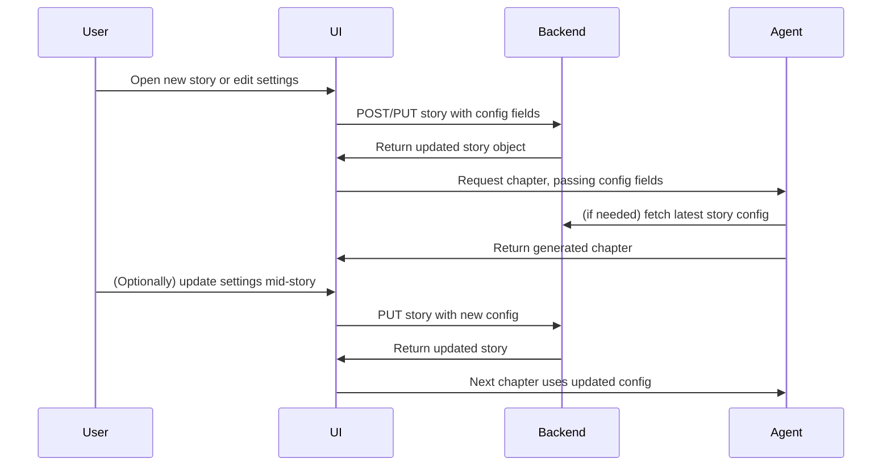

# Story Platform – Architecture & Implementation Guide

## Overview

This project is a premium, book-like, responsive story platform built with React, TypeScript, Vite, Supabase, and OpenAI. It features a distraction-free reading experience, dynamic story generation, and a robust pre-story configuration system.

---

## 1. Overall Design Principles

- **Minimal, distraction-free, book-like reading experience**
- **Premium feel:** soft backgrounds, subtle shadows, rounded corners, elegant typography
- **Responsive:** seamless on both mobile and desktop
- **Consistent layout:** clear separation between login, dashboard, and story reading

---

## 2. Component/Layout Structure

```mermaid
flowchart TD
    A[Login (Auth)] -->|On Success| B[Dashboard]
    B --> C[Story List]
    C -->|Select Story| D[Story View]
    B -->|Logout| A
    D -->|Back| C
```

- **Login:** Centered card, elevated, with clear sign-in/up toggle
- **Dashboard:** 
  - Full viewport background
  - Centered container with:
    - Top bar: Centered title, logout button in top-right
    - Story list: Card/list in center, visually separated items
    - New story button/form: Modal or inline, visually distinct
- **Story View:**
  - Centered, wide but readable container (max-width ~700px)
  - Book-like paragraphs, premium font, generous line height and spacing
  - Minimal UI: only a subtle back button and add-chapter form at the bottom

---

## 3. Styling Approach

- **New CSS classes** (e.g., `.premium-card`, `.dashboard-container`, `.story-list`, `.story-item`, `.story-content`, `.logout-btn`, `.top-bar`)
- **Typography:** Use a premium serif font for story content (e.g., "Merriweather", "Georgia", or Google Fonts alternative)
- **Spacing:** Generous padding/margin, max-widths for readability
- **Colors:** Soft, neutral backgrounds; dark text; subtle accent colors for buttons/links
- **Shadows & Borders:** Soft box-shadows, rounded corners for cards and buttons
- **Responsiveness:** Media queries for mobile (single column, touch-friendly), desktop (centered, wider containers)

---

## 4. Component Refactor Plan

- **Auth (Login):** Replace inline styles with `.premium-card` and `.auth-form`, center card, add shadow, rounded corners, large inputs/buttons, responsive.
- **Dashboard:** Add `.dashboard-container`, `.top-bar`, story list as `.story-list` with `.story-item` cards, new story form as modal or inline card, responsive.
- **Story View:** `.story-content` for book-like container, chapters separated with spacing, subtle dividers, back button as subtle icon/button, add-chapter form at bottom.

---

## 5. Accessibility & Experience

- All buttons and inputs accessible and touch-friendly
- Focus states and transitions for interactive elements
- No unnecessary distractions (no excessive colors, animations, or icons)

---

## 6. Implementation Steps

1. Create new CSS classes in `App.css` or a new CSS module.
2. Refactor `Auth.tsx` to use new classes and remove inline styles.
3. Refactor `Dashboard.tsx` for new layout, top bar, story list, and story view.
4. Add premium font (e.g., via Google Fonts in `index.html`).
5. Test and tweak responsiveness and spacing.

---

## 7. Pre-Story Configuration & Story Parameter Architecture

### Overview

The platform introduces a pre-story configuration interface and supporting backend changes. This allows users to set and update story-level parameters such as reading level, story/chapter length, and structural prompts, both before and during a story session.

### 7.1 Data Model Changes

- **Stories Table (supabase/schema.sql):**
  - `reading_level` (integer or enum): e.g., 1–10, representing grade level or mapped to age bands.
  - `story_length` (integer): Target total story length (e.g., number of chapters).
  - `chapter_length` (text): Target length per chapter (qualitative: "A sentence", "A few sentences", etc.).
  - `structural_prompt` (text, nullable): Optional structure or outline for the story.

### 7.2 Backend API Changes

- Update story creation endpoint to accept new fields.
- Update story update endpoint to allow modifying these fields mid-story.
- Ensure endpoints validate and sanitize input.
- Ensure all endpoints that return story data include the new fields.
- When generating a chapter, always fetch the latest story parameters and pass them to the agent.

### 7.3 Frontend UI/UX Changes

- **Pre-Story Configuration Interface:** Modal or dedicated screen before story start with all config fields.
- **Mid-Story Configuration:** (Optional) Add a "Story Settings" button in the story view to re-open the configuration interface and update parameters.
- **State Management:** Story settings are stored in local state and synced with backend on submit/update.
- **Validation:** UI enforces valid ranges and provides user feedback.

### 7.4 Agent Logic Changes

- Agent invocation logic always reads the latest story parameters before generating a chapter.
- Pass all relevant parameters (reading level, story length, chapter length, structural prompt) to the agent prompt.
- If parameters are updated mid-story, the next chapter generation uses the new values.

### 7.5 Integration & Update Flow



### 7.6 Summary of Required Changes

- **Database:** Add new fields to `stories` table, migrate existing data.
- **Backend:** Update endpoints for story creation, update, and fetching; ensure chapter generation uses latest config.
- **Frontend:** Implement pre-story and mid-story configuration UI; update state management and API calls.
- **Agent:** Update logic to use all config parameters for chapter generation.

---

## 8. Running & Building

- To start the client:  
  `cd client && npm install && npm run dev`
- To build for production:  
  `cd client && npm run build`
- To deploy backend functions:  
  `cd supabase && supabase functions deploy start_story && supabase functions deploy continue_story`
- To apply database migrations:  
  Use the Supabase dashboard SQL editor or CLI.

---

## 9. Notes

- All new story/chapter configuration is stored at the story level and used by the agent for every chapter.
- The UI blocks further input and shows "The End" when the story is complete.
- The architecture is designed for extensibility and a premium user experience.
