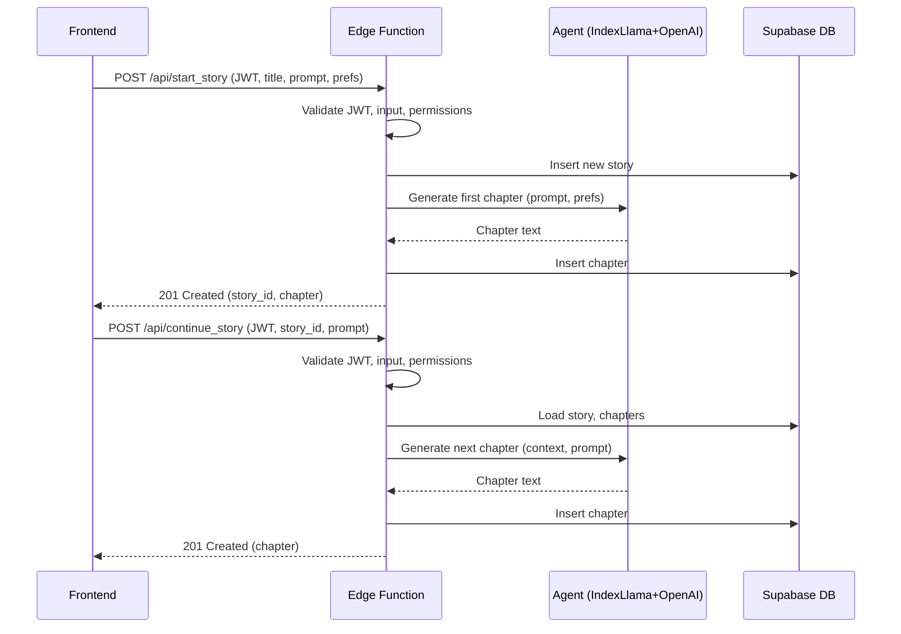

# Supabase Edge Functions Backend Design – Story Platform

## Endpoints

### 1. `POST /api/start_story`
- **Purpose:** Start a new story, generate the first chapter using the LLM agent, and save it to the database.
- **Auth:** Requires Supabase Auth JWT (Bearer token).
- **Request Body:**
  ```json
  {
    "title": "string",
    "initial_prompt": "string",
    "preferences": { "optional": "object" }
  }
  ```
- **Response:**
  - `201 Created` with:
    ```json
    {
      "story_id": "uuid",
      "chapter": {
        "id": "uuid",
        "chapter_number": 1,
        "content": "string",
        "created_at": "timestamp"
      }
    }
    ```
  - Error responses: `401 Unauthorized`, `400 Bad Request`, `500 Agent/DB Error`

### 2. `POST /api/continue_story`
- **Purpose:** Continue an existing story, generate the next chapter, and persist it.
- **Auth:** Requires Supabase Auth JWT (Bearer token).
- **Request Body:**
  ```json
  {
    "story_id": "uuid",
    "prompt": "string (optional, for user guidance)"
  }
  ```
- **Response:**
  - `201 Created` with:
    ```json
    {
      "chapter": {
        "id": "uuid",
        "chapter_number": "int",
        "content": "string",
        "created_at": "timestamp"
      }
    }
    ```
  - Error responses: `401 Unauthorized`, `404 Not Found`, `400 Bad Request`, `500 Agent/DB Error`

---

## Backend Flow

- **Auth:** Validate and decode Supabase Auth JWT, extract user ID.
- **Validation:** Check input, permissions, and story ownership.
- **Agent Call:**
  - For `start_story`: Create story, call agent with initial prompt and preferences.
  - For `continue_story`: Load story and chapters, call agent with full context and user prompt.
- **Persistence:** Save generated chapter, update story metadata (e.g., `updated_at`).
- **Error Handling:** Return sanitized error messages, no partial writes on agent failure.

---

## Agent Integration

- Encapsulated agent module (IndexLlama + OpenAI).
- Input: story context, user preferences, prompt.
- Output: generated chapter text.
- Handles timeouts, retries, and errors gracefully.

---

## Security, Scalability, Maintainability

- Strict JWT authentication and per-user authorization.
- Input validation, error handling, and logging.
- Stateless, horizontally scalable Edge Functions.
- Modular code structure for maintainability.

---

## Mermaid Diagram



---

## Next Steps

1. Define TypeScript types and implement Edge Functions with agent integration, DB ops, and error handling.
2. Set up logging, (optional) rate limiting, and write endpoint tests.
3. Document API for frontend integration.