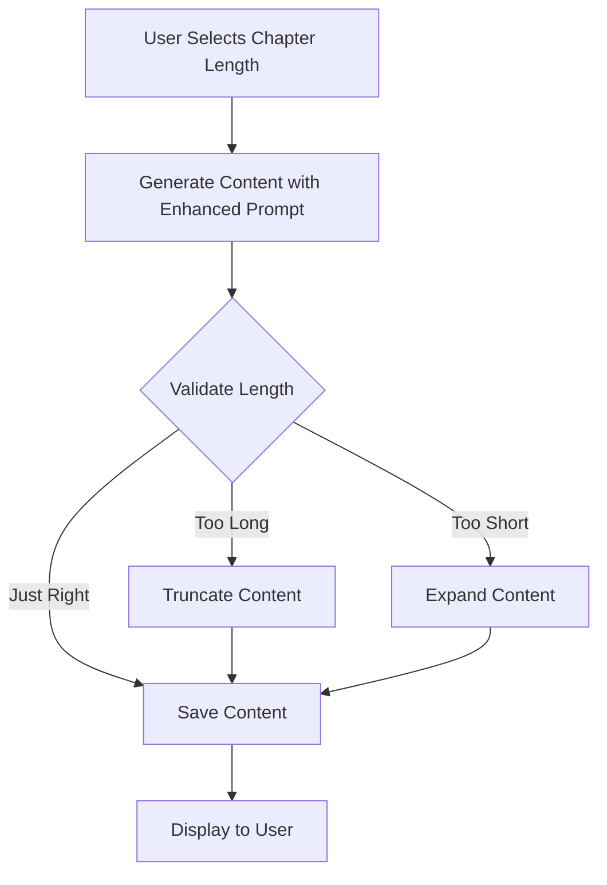
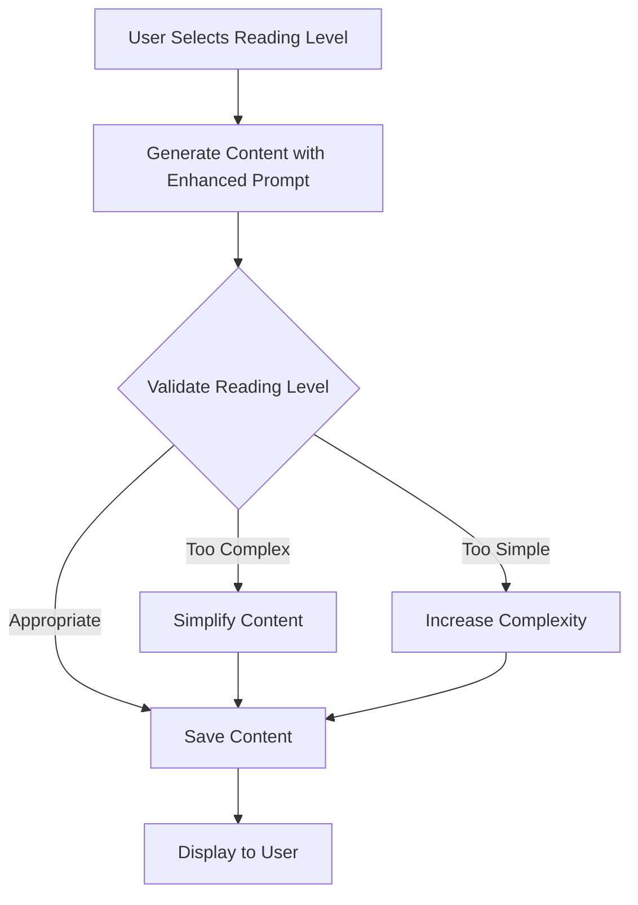

# Story Generation System Improvements

## Executive Summary

This document outlines a comprehensive plan to address two critical issues in our story generation system:

1. **Chapter Length Control**: Ensuring generated text strictly adheres to intended length parameters
2. **Text Complexity Calibration**: Creating a more nuanced reading level system beyond the current grade-level designation

The plan includes both backend enhancements and frontend improvements to create a more robust, user-friendly system that generates appropriately formatted, age-appropriate content.

## Current System Analysis

### Chapter Length Control
- **Current Implementation**: 
  - 5 predefined options: "A sentence", "A few sentences", "A small paragraph", "A full paragraph", "A few paragraphs"
  - Length instructions are passed to the LLM in the prompt: `"Length: EXACTLY ${chapterLength}"`
  - No mechanism to enforce or validate the actual length of generated content
  - No clear definitions of what constitutes each length category

### Reading Level System
- **Current Implementation**:
  - Simple grade-level designation from Kindergarten to 10th grade
  - Represented as a slider in the UI
  - Passed to the LLM as: `"Reading level: ${readinglevel}"`
  - No detailed guidance for vocabulary complexity, sentence structure, or other linguistic features
  - No validation or enforcement mechanism

## Issue 1: Chapter Length Control

### Problem Statement
The current system doesn't effectively enforce the selected chapter length constraints, resulting in generated text that may be significantly longer or shorter than intended.

### Proposed Solution

#### 1. Backend Enhancements

1. **Length Definition Framework**:
   - Create precise definitions for each length option with specific character/word/sentence count ranges
   - Example:
     - "A sentence": 1 sentence (10-20 words)
     - "A few sentences": 2-4 sentences (20-60 words)
     - "A small paragraph": 4-6 sentences (60-100 words)
     - "A full paragraph": 6-10 sentences (100-150 words)
     - "A few paragraphs": 2-3 paragraphs (150-300 words)

2. **Post-Generation Validation & Truncation**:
   - Implement a validation function that checks if generated content meets the length requirements
   - Add truncation logic to trim excessive content while maintaining narrative coherence
   - Add expansion logic for content that's too short

3. **Enhanced Prompt Engineering**:
   - Revise system prompts to include specific word/sentence count targets
   - Add explicit instructions about adhering to length constraints
   - Include examples of appropriate length responses

4. **Two-Stage Generation Process**:
   - First stage: Generate content according to length constraints
   - Second stage: If content doesn't meet requirements, send it back to the LLM with specific instructions to adjust length

#### 2. Frontend Improvements

1. **Visual Length Indicators**:
   - Add word/character count estimates next to each length option
   - Display actual content length in the chapter view

2. **Length Preview**:
   - Add visual indicators showing approximate content length when selecting options

3. **Custom Length Option**:
   - Add an advanced option for users to specify exact word/sentence counts

## Issue 2: Text Complexity Calibration

### Problem Statement
The current grade-level designation is too simplistic and doesn't provide enough granularity or guidance for generating age-appropriate content across the developmental reading spectrum.

### Proposed Solution

#### 1. Backend Enhancements

1. **Comprehensive Reading Level Framework**:
   - Develop a multi-dimensional reading level system with these components:
     - **Vocabulary Complexity**: Common words vs. advanced/rare words
     - **Sentence Structure**: Simple vs. complex sentence constructions
     - **Narrative Complexity**: Linear vs. multi-layered storytelling
     - **Conceptual Depth**: Concrete vs. abstract concepts
     - **Thematic Sophistication**: Simple themes vs. nuanced themes

2. **Reading Level Profiles**:
   - Create detailed profiles for each reading level with specific parameters:
     - **Early Reader (K-1)**: 
       - 95% common words, simple sentences, concrete concepts
       - Avg. sentence length: 5-8 words
       - Repetition of key phrases
     - **Developing Reader (2-3)**:
       - 90% common words, some compound sentences
       - Avg. sentence length: 8-12 words
       - Simple cause-effect relationships
     - **Intermediate Reader (4-5)**:
       - 85% common words, varied sentence structures
       - Avg. sentence length: 12-15 words
       - Multiple character perspectives
     - **Advanced Reader (6-8)**:
       - 75% common words, complex sentences with clauses
       - Avg. sentence length: 15-20 words
       - Abstract concepts introduced
     - **Sophisticated Reader (9-10)**:
       - 65% common words, varied complex structures
       - Avg. sentence length: 20+ words
       - Nuanced themes and concepts

3. **Enhanced Prompt Engineering**:
   - Revise system prompts to include specific guidance for each dimension
   - Include examples of appropriate vocabulary and sentence structures
   - Add reference to established readability metrics (Flesch-Kincaid, Lexile)

4. **Post-Generation Validation**:
   - Implement readability analysis to verify the generated content matches the target level
   - Add adjustment logic to modify content if it doesn't meet the target level

#### 2. Frontend Improvements

1. **Multi-Dimensional UI**:
   - Replace the single slider with a more comprehensive interface
   - Add separate controls for advanced users to fine-tune different dimensions
   - Include a "Simple Mode" with presets for casual users

2. **Visual Reading Level Indicators**:
   - Add visual representations of reading level complexity
   - Include sample text snippets demonstrating each level

3. **Reading Level Preview**:
   - Show key metrics for selected level (avg. sentence length, vocabulary level)
   - Provide real-time feedback as settings are adjusted

## Implementation Plan

### Phase 1: Research and Design (2 weeks)
1. Research established readability metrics and frameworks
2. Define precise length parameters for each chapter length option
3. Create detailed reading level profiles
4. Design enhanced UI mockups
5. Draft improved LLM prompts

### Phase 2: Backend Implementation (3 weeks)
1. Implement length validation and adjustment functions
2. Develop reading level analysis and validation system
3. Update edge functions with enhanced prompts
4. Create test suite for validation

### Phase 3: Frontend Implementation (2 weeks)
1. Update UI components with new controls
2. Implement visual indicators and previews
3. Add real-time feedback mechanisms

### Phase 4: Testing and Refinement (2 weeks)
1. Conduct comprehensive testing across different settings
2. Gather user feedback
3. Refine algorithms and UI based on feedback
4. Optimize performance

### Phase 5: Deployment and Monitoring (1 week)
1. Deploy updates to production
2. Monitor system performance
3. Collect user feedback
4. Plan for future enhancements

## Technical Considerations

1. **Performance Impact**:
   - Additional validation steps may increase response time
   - Consider implementing asynchronous processing for length/complexity adjustments

2. **Storage Requirements**:
   - Enhanced reading level profiles may require additional storage
   - Consider caching common profiles for performance

3. **Backward Compatibility**:
   - Ensure existing stories continue to function with new system
   - Provide migration path for stories created with old system

4. **Error Handling**:
   - Implement robust fallback mechanisms if validation fails
   - Provide clear error messages to users

## Code Changes Required

### Backend Changes

1. **Edge Functions**:
   - Update `start_story/index.ts` and `continue_story/index.ts` with enhanced prompts
   - Add length validation and adjustment functions
   - Implement reading level analysis

2. **Database Schema**:
   - Add fields for storing detailed reading level parameters
   - Add fields for tracking actual content metrics

### Frontend Changes

1. **Component Updates**:
   - Enhance `StorySettingsDialog.tsx` with new controls
   - Update `NewStoryDialog.tsx` with improved UI
   - Add visual indicators to `ChapterList.tsx`

2. **Type Definitions**:
   - Update `story.ts` to include new reading level parameters
   - Update `chapter.ts` to include content metrics

## Next Steps

1. Form a dedicated team for implementation
2. Prioritize features based on user impact
3. Create detailed technical specifications
4. Develop a testing strategy
5. Set up monitoring for post-deployment